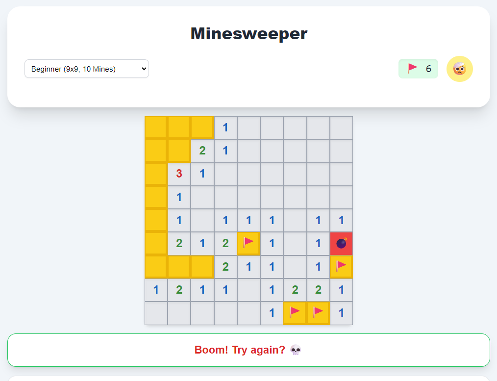

💣 Minesweeper
==============

A modern, fully responsive implementation of the classic Minesweeper game, built with React and contained in a single HTML file for easy deployment.

[Play Now](http://mines.s3is.com)

How to Play: Interactive Demo
-----------------------------

This section provides an interactive guide to the game's core mechanics. Click on any feature button to see a visual demonstration on the grid below.

### Reveal Cell

Click a safe cell to clear it. The number indicates adjacent mines.

### Place Flag

Right-click or use Flag Mode to mark suspected mines.

### Chord Functionality

Double-click a revealed number to quickly clear its safe neighbors.

Difficulty Levels
-----------------

The game offers three standard modes to challenge players of all skill levels. The grid dynamically resizes to fit your screen in any mode.

### Beginner

9x9 Grid

10 Mines

### Intermediate

16x16 Grid

40 Mines

### Expert

30x16 Grid

99 Mines

Gameplay Screenshot
-------------------

